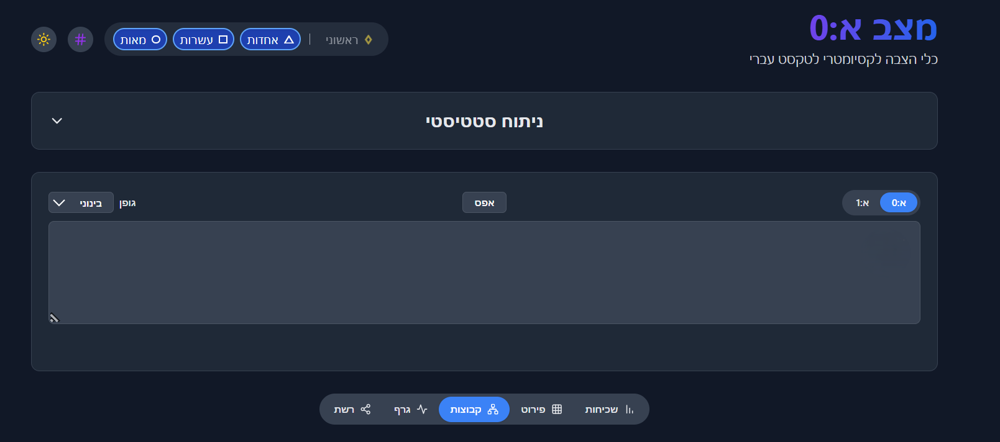

# AlephEfes - reproducible code and data for numeric–semantic analysis of the Hebrew language

This repository contains a React-based calculator and research notes around the **א=0** hypothesis.
The project treats the abjad consonants as a deliberately engineered system where Hebrew letters are mapped to positions **0–21** and processed through a **three-layer decimal valuation** (Units, Tens, Hundreds). The calculator interface is currently only in **Hebrew**. I will add an English option in the future.

> You can visit the app without installing here:
[https://aleph-efes.vercel.app/]

---



---

## What you can do with the calculator

The calculator includes the following capabilities:

- **Five analysis workspaces (tabs)**
  - *Lines (פירוט)*: full line-by-line and word-by-word breakdowns, including line totals, per-word values, grand totals, and digital roots. Shift between line input presentation and unique words presentation.
  - *Clusters (קבוצות)*: digital-root neighborhoods with interactive cards and pin/hover relation highlighting. Grouped by digital root
  - *Hot Words (שכיחות)*: frequency analysis in two modes (*values* and *words*) with sortable tables and drill-down from value → matching words.
  - *Graph (גרף)*: a quantitative chart showing which values dominate by total occurrences, unique-word coverage, and cross-layer bridge score.
  - *Network (רשת)*: an interactive force-directed graph linking words to visible numeric values (U/T/H) with zoom, pan, drag and click selection.

- **Dual Calculation Modes**
  Switch between Aleph-Zero (א=0) and Aleph-One (א=1) mappings. Both modes apply the same 3-layer valuation with different base indexing.

- **Digital Root Clusters (ש״ד)**
  Words are grouped by digital root (0–9), with interactive drill-down from the root distribution panel and search within cluster results.

- **Prime Highlights**
  Prime totals are detected per word value, and per line. You can filter to primes-only output and customize the prime highlight color in the legend.

- **Layer filtering**
  Toggle visibility for **U / T / H** layers (and prime-only mode) globally.

- **Dark Mode**
  Auto-detects system preference, toggleable at runtime.

- **Input and workflow ergonomics**
  Hebrew-input sanitization for pasted/typed text, text-size controls, persistent last text via `localStorage`, and quick return-to-top UI controls.

- **Performance**
  Uses memoization, virtualized lists for long frequency tables, and a Web Worker-backed core computation engine (with fallback to main thread) for handling large texts efficiently.

---

## Running the calculator

Requires Node.js 18+ and npm.

### First-time setup

```bash
git clone https://github.com/EdanDa/AlephEfes.git
cd AlephEfes
npm install
npm run dev -- --host
```

### Subsequent updates in the same folder

```bash
cd AlephEfes
git pull
npm install
npm run dev -- --host
```

### Alternative start commands

```bash
git clone https://github.com/EdanDa/AlephEfes.git
cd AlephEfes
npm install
# Option 1 (recommended):
npm start
# Option 2:
npm run dev
```

By default the app runs on [http://localhost:5173](http://localhost:5173) with `npm run dev` (or port 4173 with `npm start` at [http://localhost:4173](http://localhost:4173).), styled with TailwindCSS (loaded via CDN).
It stores the last analysed text in `localStorage` for convenience.

---

## Structure

```
├── index.html
├── src/
│   ├── App.jsx
│   ├── main.jsx
│   ├── components/
│   │   └── VirtualizedList.jsx
│   ├── core/
│   │   └── analysisCore.js
│   ├── state/
│   │   ├── appReducer.js
│   │   └── appStore.jsx
│   └── workers/
│       └── coreResults.worker.js
├── tests/
│   ├── analysisCore.test.js
│   └── appReducer.test.js
├── docs/
│   └── demo.png
├── package.json
└── vite.config.js
```

---

## Research backdrop: theory and evidence to date

I treat א=0 as a historical object of investigation: a survival of symbolic technologies that were spoken, counted, ritualized, listed, calendrical, astronomical, theological, administrative, scribal, and canonical. The Hebrew Bible preserves one of the strongest surviving deployments of that technology.

I arrived at it through a simple state shift: **בראשית** begins with **ב**, and ב is the first letter of the text. Assigning ב=1 yields א=0. From there the decimal index naturally runs through the 0–9 unit band before the tens stratum begins.

The evidence is cumulative and structural. Its force does not come from isolated matches, but from recurrence across stable Hebrew spellings, divine names, transliterations, calendrical values, digital-root classes, Aleph-sensitive equivalences, anagrammatic value equality, semantic basins, textual centers, repeated formulae, and full corpus units.

This is a theory of canonical orthographic transformation: a way to read the Hebrew alphabet as a zero-indexed coordinate system in which letter order, value, spelling, textual design, calendar, divine number, and cultural memory operate together.

---

## 1) Zero-indexed valuation as a constrained coordinate system

Parts of the following formalization use modern mathematical terminology, but the resulting table and value assignments are proposed here as a reconstruction of a scribal mental model.

Hebrew letters are assigned values from:

```text
א=0, ב=1, ג=2, ... ת=21
```

Final forms collapse to their base letter:

```text
ך=כ, ם=מ, ן=נ, ף=פ, ץ=צ
```

From this index arise three additive homomorphisms over words:

* **U / Units** — the raw index sum.
* **T / Tens** — U plus the decimal band shift from ל to ת.
* **H / Hundreds** — T plus the hundreds-band at ש and ת.

In א=0, the layers are:

```text
U: א=0 ... ת=21

T: א=0 ... י=9, כ=10, ל=20, מ=30, ... ש=110, ת=120

H: א=0 ... ק=90, ר=100, ש=200, ת=300
```

For every word or phrase:

```text
U(w) ≡ T(w) ≡ H(w) mod 9
```

So digital-root class is stable across layers.

U/T/H are therefore coordinated projections of the same alphabetic order under decimal expansion. Once alphabetic order, additivity, final-letter normalization, threshold behavior, and mod-9 invariance are fixed, the system becomes constrained.

The shift from א=1 to א=0 is not a decorative change. It changes the ontology of the first sign:

```text
א=1 counts the alphabet.
א=0 indexes the alphabet.
```

Under א=0, א is not the first counted unit. It is the silent coordinate of beginning.

---

## 2) Aleph as null operator and editorial handle

Under א=0, Aleph contributes no numerical value. It is the additive identity.

```text
א is orthographically visible,
but arithmetically null.
```

This makes א structurally active. It can alter category, register, mythic status, theological framing, or lexical profile without changing the value of the form.

This functionality appears to be a Hebrew-alphabetic transformation of older scribal category-marking practices, especially the functions of the cuneiform sign **𒀭 / AN / DINGIR**. The sign 𒀭 served simultaneously as:

```text
the number 60,
the god An / Anu,
the sky / heaven,
a divine-name marker, a non-vocalized determinative before divine names.
```

Its value 60 in the sexagesimal system makes it a cycle-completion sign. In base-60 digital-root terms, it also touches the 59-modular boundary:

```text
60 ≡ 1 mod 59
```

So 𒀭 is a visible sign of divine classification, heavenly order, and sexagesimal completion that is not vocalized as an ordinary phonetic unit in divine names.

Examples of Aleph-sensitive pairs include:

```text
דם / אדם
מת / אמת
בריה / בריאה
מלך / מלאך
מלכה / מלאכה
מלכות / מלאכתו
שרה / אשרה
מרבה / אברהם
מילה / אלהים
בן / אבן
נשר / אנשר
```

The comparison is functional: both 𒀭 and א under א=0 can be understood as visible classificatory signs that do not behave like ordinary counted phonetic units in all contexts.

This makes א=0 relevant to older scribal practices of category-marking, divine naming, and symbolic indexing.

---

## 3) Orthographic transformations, anagrams, and semantic basins

A number is not simply “the number of X” in isolation. The value-neighborhoods are treated here as intentionally orthographically designed clusters.

The working hypothesis is that א=0 reveals and reconstructs **historically encoded semantic basins**: symbolic neighborhoods shaped, preserved, and repurposed by ancient scribal institutions through alphabetic order, orthography, modular arithmetic, divine names, calendar numbers, textual design, and canonical compression.

It does not merely produce these basins. It exposes them.

A semantic basin may include:

* direct value equality,
* cross-layer equality,
* digital-root coherence,
* Aleph-sensitive pairs,
* anagrams and near-anagrams,
* orthographic recodings,
* textual-position effects,
* calendar-scale lifts,
* divine-name correspondences,
* and links to known ancient symbolic constants.

Under א=0, anagram is not decorative. It is one of the system’s transformation operators. The same value-space can preserve a lexical neighborhood through permutation, Aleph insertion, Aleph deletion, or layer-shift.

Examples include:

```text
בבל = לבב = בלב
אין = אני
גל = גאל = אגל
```

The important point is not only that such forms are equal. It is that they generate **families of orthographic motion**: forms that move within the same basin while changing semantic direction.

Thus א=0 is a simple formal state shift with large interpretive consequences:

```text
from counting the alphabet
to indexing the alphabet

from identity-first
to origin-first

from word-value
to orthographic transformation

from isolated equality
to semantic basin

from 1 as the first counted sign
to 0 as the silent coordinate of beginning
```

The structures it reveals correspond to older acts of symbolic engineering. These acts are hypothesized to have taken place in the scribal “technology companies” of their time: libraries, temples, palace schools, archives, priestly circles, lexical-list traditions, calendar specialists, astronomers, administrators, and canon-forming institutions.

The basins are therefore treated as possible artifacts of engineering and design: compression, repurposing, encoding, and deployment of symbolic communication. In cultural terms, this may describe not only an “exit from Egypt” for Israelites defined through Jacob, but also a formal exit from Akkadian, Babylonian, and Sumerian symbolic regimes for the Fertile Crescent.

These basins preserve a cultural logic older than the final biblical canon and possibly older than alphabetic writing itself. Values such as 354, 365, 360, 52, 49, 30, 22, and practical approximations such as 22/7 for π belong to the observable and abstracted world that groups have tracked, memorized, ritualized, and transmitted long before formal writing. Writing did not create those constants; it captured, compressed, and reassigned them.

The research was not designed to expose anything. It began, and still proceeds, as an experiment: zero-index the Hebrew alphabet and check what happens to lexical units, textual units, and inherited symbolic material. I was not expecting any of this, did not set out to validate any pre-existing belief (I have none), and am actively still researching the entire idea and its plausibility.

I am a naturalist, non-religious, science-driven individual. Everything claimed here is my best working model as of today. Everything is open to discussion and revision. I welcome challenge, critique, refinement, and any explanation that improves, defeats, or renders this model impossible.

The names, values, calendar seams, divine numbers, textual centers, and self-pointing forms recur in structurally relevant places. That recurrence is hard to dismiss as ordinary lexical noise.

---

## 4) Historical frame: the 22-letter skeleton

The Northwest-Semitic 22-letter consonantal skeleton is central.

The short Ugaritic alphabetic tradition witnesses a 22-slot order aligned with the later Phoenician / Modern Hebrew sequence. The 22-letter order predates the biblical canon. א=0 can be read as a continuation, reactivation, stabilization, and canonical deployment of a prior meaningful alphabetic sequencing technology.

This is important because the claim is not that biblical Hebrew randomly acquired a useful alphabetic order. The stronger model is that ancient scribes created, stabilized, and transmitted a 22-slot symbolic instrument.

If 7, 11, 22, 36, 49, 52, 59, 60, 360, 364, and 365 already carried calendrical, astronomical, theological, administrative, and mathematical significance in ancient scribal environments, then a 22-letter skeleton is not merely a phonetic inventory. It can become a calibrated symbolic machine.

---

## 5) Calendrical, astral, and divine-number alignments

Certain values recur as cultural attractors: numbers that mattered in ancient scribal worlds because of calendars, lunar cycles, solar cycles, ranked divine arithmetic, sexagesimal structure, decimal structure, and schematic time.

The following are some of, but not all, the self-referential and calendrical pointers:

```text
יהוה      → 22
לבנה      → 29
חדש       → 30
שמש       → 52

אירשנה     → 353 in H
קדשתם     → 353 in T

ישרון / כהנת     → 354 in H
תורתי             → 354 in T

מלאות / כתובים / כשרון     → 355 in H
יתבששו                    → 355 in T

עת        → 360 in H
שער / עשר / רעש        → 360 in H

ירושלם    → 364 in H

מלכות     → 365 in H
עשור / עושר / שעור     → 365 in H
סכות      → 365 in H

נגלתה / בעתו / המילדת     → 366 in H
חקרתני                    → 366 in T

לדעת / האתנים     → 383 in H
אתננה             → 384 in H
תירשון            → 384 in T
```

These values form calendrical and symbolic bridges:

```text
29  ↔ lunar month neighborhood
30  ↔ civil / schematic month
52  ↔ whole weeks in a 365-day year
353/354/355 ↔ lunar-year range
360 ↔ ideal / sexagesimal / circle-year
364 ↔ 52×7 schematic solar calendar
365/366 ↔ solar civil year
383/384/385 ↔ embolismic / leap-year neighborhood
```

The 52 basin is not only:

```text
שמש = 52
```

It also intersects with solar, royal, and cosmic-order material. In cross-cultural name material and transliterations, several solar and solar-adjacent figures converge on U=52 under א=0, including:

```text
שימגי   Šimegi / Šimige, the Hurrian sun-god
וישנו   Vishnu, god of preservation in Hinduism
סקמט    Sekhmet, solar deity in Egyptian mythology, the eye of Ra
מיטרה   Mithra / Mitra, Persian and Vedic solar-contractual figure
היליוס  Helios, Greek personification of the Sun
סוריו   Sūrya / sūryo, the Sun and solar deity in Hinduism
רתאם    ṛtam, Sanskrit concept of cosmic order, truth, and rightness
```

And:

```text
אדני = 52 in T
```

Another bridge is:

```text
ישראל = 59 in U
ישרון = 354 in H
354 = 59 × 6
```

This is the kind of calendar-scale expansion expected if base values functioned as generators and higher layers as structured enlargements.

---

## 6) The 36 basin: אלהים = מילה

Seeing **אלהים = מילה**, 36 is not merely a theological value. It is the basin where divinity, word, speech, distinction, naming, ordering, and world-formation meet.

The 36 basin includes:

```text
אלהים
מילה
מבדיל
מסך
סמך
סדר
עת
מאור
ארץ
נהר
גיחון
עוף
עשב
צמח
נקבה
ילדה
לידה
מרבה
דמים
השם
משה
אהרן
אברהם
במדבר
```

This makes 36 a basin of articulation: the world is not merely present; it is divided, named, spoken, ordered, fertilized, spatialized, timed, and made transmissible.

The Egyptian decanal system strengthens this reading. The 36 decans divide celestial time into schematic units. 36 is not an arbitrary value. It belongs to ordered sky-time, schematic division, and the geometry of squares, circles, and cycles.

---

## 7) Additional major basins

### 22: name, being, self, negation, command, knowledge

The 22 basin includes and connects:

```text
יהוה
והיה
יהי
אני 
אין
גאל
גל
גאולה
יבם
מאחד
מביא
סוד
דעה
עדה
צו
דבק
אדר
דר
גבר
רגב
בת
אבת
```

This creates a basin of being, selfhood, negation, command, knowledge, testimony, redemption, generation, and relational attachment.

Especially important:

```text
אין = אני
```

Negation and selfhood share the same basin. This sits beside יהוה=22 and makes 22 a field of being/non-being, self-reference, divine name, command, and canonical speech.

### 49: seven squared, text, language, fear, law, and threshold

49 is not only 7². It is a threshold number.

It gathers forms such as:

```text
אין / אני through 22→49
אחדים
ליל
יריחו
מוריה
לשון
כפרה
ערלה
נשמה
מקרא
ספר
נפש
שקל
ענת
דברות
ששי
תורה
תירא
תחת
```

This makes 49 a basin of sevenfold completion, language, text, law, fear, threshold, body, covering, removal, soul, and transmission.

### 52: sun, order, kingship, inheritance, song

52 is not only שמש. It also gathers:

```text
שמש
אדני in T
סבב in T
מאזנים
משלי
שירה
סערה
הישר
ירשה
נחלת
עקר
פרץ
נשר / אנשר
תמר
```

This basin connects sun, cycle, lordship, balance, wisdom, song, storm, rightness, inheritance, rupture, bird/sky symbolism, and fertility.

### 59: binding, covenant, kingdom, root, bow, cycle

59 is a basin of binding and obligation:

```text
אנכי in T
מלכות
לויתן
האתנים
ישראל
בריתי
עושר
עשור
פרשה
שרש
קשת
```

Especially important:

```text
ישראל = 59 / 239
בריתי = 59 / 239
```

This is not only a shared value. It is a covenantal identity field.

Also:

```text
מלכות = 365 in H
עשור / עושר / שעור = 365 in H
```

So 59 expands into solar-year scale through kingdom, wealth, measure, and tenth-cycle vocabulary.

---

## 8) Cross-layer coherence and structural units

Because U/T/H are linked, alignments recur across layers and form dense semantic nodes rather than one-off matches. The strongest claims prioritize structured units: positions, repetitions, symmetry, phrase frames, textual centers, and self-pointing forms.

### Babel / Genesis 11:1–9

A central worked example is **Babel / Genesis 11:1–9**, analyzed as a structural test case under א=0.

```text
121-word unit = 11²
Structure: 60 + האדם + 60
Center word: האדם, position 61
First occurrence of יהוה appears at word 52
בבל functions as a 13→22 gate across layers
22 digital-root-4 terms split 11/11 around the center
יהוה appears 5 times
הארץ appears 5 times
```

Babel is therefore not merely a story about language confusion. It is a textual unit about the collapse of a unified symbolic-operational regime.

The unit begins with:

```text
שפה אחת ודברים אחדים
```

This does not describe only a shared spoken language. It describes a unified regime of speech, matters, words, commands, records, and symbolic operation.

The human project tries to convert that unity into:

```text
city
tower
heavens
name
anti-dispersion
```

יהוה breaks the operating layer itself:

```text
ונבלה שם שפתם
```

Important internal structures include:

```text
בבל = 13 / 22 / 22
```

Babel is not inside the 22-core the way יהוה is. It enters 22 through higher layers. It is a broken gate into the יהוה-governed 22 field.

The repeated phrase:

```text
על פני כל הארץ
```

appears as the human fear, the divine execution, and the final closure.

The word:

```text
שם
```

moves through place, name, reputation, site of confusion, and etiology:

```text
וישבו שם
ונעשה לנו שם
ונבלה שם שפתם
כי שם בלל יהוה
```

The phrase-level reversal is also exact:

```text
ויאמרו איש אל רעהו
```

becomes:

```text
אשר לא ישמעו איש שפת רעהו
```

Under א=0:

```text
אל = לא
```

So communicative direction becomes communicative negation without value change.

Another self-pointing structure:

```text
וזה החלם לעשות = 121 in U
```

The phrase diagnosing the beginning of human action carries the word-count value of the whole Babel unit.

Babel therefore operates as a full structural demonstration of the project’s claim: language, name, place, authority, divine descent, human centrality, and dispersion are organized through value, position, repetition, and reversal.

### Genesis 1 / The seven-day unit

Another important textual unit is **Genesis 1**, where the seven days receive the digital-root sequence:

```text
7 - 1 - 2 - 3 - 5 - 4 - 8
```

Observations include:

```text
בראשית = 70 → digital root 7
Day 1 total → digital root 7
Day 1 word count → 52 → digital root 7
Full week total → digital root 3
```

Day 1 of the defining cycle that creates the framework for 52 weeks opens with a triple 7-lock:

```text
first word → 7
day total → 7
word count 52 → 7
```

The full week closes on digital-root 3, aligning with the fourth day, the center of the seven-day structure, on which the sun, moon, signs, seasons, days, and years are introduced in the text.

### Genesis 23 / Sarah, Heth, burial, and 127

A third example is **Genesis 23**, where Sarah dies at:

```text
127 years
```

The chapter centers on the sons of Heth:

```text
בני חת
```

Under א=0:

```text
חת = 127 in T
```

This aligns the people involved in Sarah’s burial transaction with Sarah’s age at death. The specific age and the people of the transaction appear selected to align.

The chapter also closes on digital-root 7, and:

```text
ח = 7
```

This creates a bridge between the name of the letter, the people, the transaction, the age, and the lexical biblical unit.

These recurring names, values, calendar anchors, divine numbers, textual centers, and self-pointing forms in structurally relevant places are treated here as difficult to reduce to ordinary lexical noise.

---

## 9) Agency model: design, encoding, concealment, and forgetting

The live hypothesis is that the system was engineered by thinking individuals.

These agents may have included scribal schools, priestly circles, temple institutions, palace archives, astronomers, calendar specialists, lexical-list keepers, and canon-forming editors. Multiple social positions may have converged in the same individuals. In modern language, these were the symbolic technology institutions of their world.

The model allows several historical layers.

### 1. Pre-written symbolic inheritance

Some constants may long predate writing: lunar years, solar years, seasonal cycles, 7-based recurrence, 30-day months, 360-style schematic cycles, 365-day solar counts, and practical approximations such as 22/7.

These could have circulated as counted, ritualized, architectural, calendrical, astronomical, administrative, or oral knowledge before being formalized in writing.

### 2. Strong design core

At some historical stage, alphabetic order, divine names, calendar constants, inherited mythic material, and scribal number-logic may have been intentionally compressed into a written symbolic system.

This is where א=0 becomes historically significant: a possible reconstruction of a foundational design choice.

The stronger model is not blind emergence. It is concentrated symbolic engineering at the root of the system, followed by later deployment, preservation, and partial forgetting.

### 3. Canonical deployment

Biblical textual units may then have used this inherited engineered technology in deliberate ways: through word choice, orthography, textual length, centers, repetitions, name placement, phrase reversal, calendar-scale values, and cross-layer design.

### 4. Distributed transmission

Later scribes and communities could grow inside the language and literature without knowing the original operating logic. They would preserve, copy, interpret, ritualize, and transmit structures already embedded in the spelling and textual fabric.

### 5. Forgetting and naturalization

The code survives as intention embedded in language and scrolls after the literature is sealed. Later generations then come to experience the inherited symbolic construction as natural history, sacred language, ethnic origin, divine memory, or cosmogenic truth.

This does not require every biblical author or copyist to know the system. It also does not reduce the structure to accidental emergence. A designed symbolic layer can persist through later tradition even when its original rationale becomes opaque.

---

## 10) א=1 as comparison mode

The same analytic pipeline can be run under א=1:

```text
א=1, ב=2, ... ת=22
```

In this implementation, the T layer ends with:

```text
ר=110, ש=120, ת=130
```

This creates a distinct comparative alignment field:

```text
110 → Joseph and Joshua, the Egyptian ideal life span
120 → Moses and the Genesis lifespan limit, the Babylonian ideal life span
130 → Adam begets Seth
```

Each mapping is unique. For shift index n relative to א=0, values follow:

```text
Uₙ(w) = U₀(w) + n·L(w)
```

where L(w) is normalized word length.

Any shift therefore introduces a length-multiplier term and repositions value neighborhoods, while preserving the shared decimal-layer construction logic.

א=1 is therefore useful as a comparison mode, but א=0 remains the primary reconstruction because it is the state in which Aleph becomes the silent coordinate of beginning and the canonical basins become structurally dense.

---

## 11) Working thesis

The working thesis of this repository is:

```text
א=0 is not gematria.
It is a zero-indexed theory of canonical orthographic transformation.
```

The Hebrew Bible preserves a major deployment of a symbolic technology in which:

```text
alphabetic order,
divine name,
calendar number,
orthography,
textual center,
semantic basin,
anagram,
Aleph-null transformation,
and canonical memory
```

operate together.

This technology appears to have emerged from ancient scribal cultures that already knew how to bind number, sky, god, king, law, archive, ritual, and calendar into public symbolic systems.

Under this hypothesis, א=0 is not an arbitrary modern overlay. It is a reconstruction of an older coordinate logic: a way in which the alphabet was made to carry world-order.

The deepest claim is not that numbers hide meanings inside words. The claim is that ancient scribes engineered a public symbolic medium in which word, number, name, calendar, and authority were compressed into one transmissible form.

```text
יהוה = 22
```

is not merely a value.

It is the signature of the format.

---

## License

MIT

## Author

Developed by **Edan-David Eyon**
Independent researcher (Israel)

I have been pursuing independent study across philosophy, linguistics, history, mathematics and more since 2011.
The AlephEfes repository documents and shares a reproducible numeric–semantic framework for the Hebrew Bible and language, which may preserve and transform older Mesopotamian, Phoenician, Akkadian, and broader Northwest-Semitic scribal traditions.
This repository is intended as an open, transparent resource for testing, replication, and dialogue.
