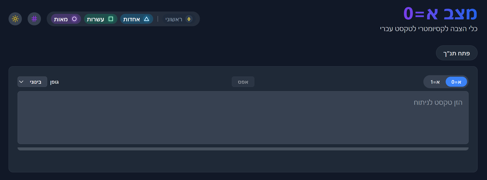

# AlephEfes - reproducible code and data for numeric–semantic analysis of the Hebrew language

This repository contains a React-based calculator and research notes around the **א=0** hypothesis.
The project treats the abjad consonants as a deliberately engineered system where Hebrew letters are mapped to positions **0–21** and processed through a **three-layer decimal valuation** (Units, Tens, Hundreds). The calculator interface is currently only in **Hebrew**. I will add an English option in the future.

> You can visit the app directly here:
[https://aleph-efes.vercel.app/]

---



---

## What you can do with the calculator

The calculator includes the following capabilities:

- **Five analysis workspaces (tabs)**
  - *Lines (פירוט)*: full line-by-line and word-by-word breakdowns, including line totals, per-word values, grand totals, and digital roots. Shift between line input presentation and unique words presentation.
  - *Clusters (קבוצות)*: digital-root neighborhoods with interactive cards and pin/hover relation highlighting. Grouped by digital root
  - *Hot Words (שכיחות)*: frequency analysis in two modes (*values* and *words*) with sortable tables and drill-down from value → matching words.
  - *Value Map (מפת ערכים)*: a quantitative chart showing which values dominate by total occurrences, unique-word coverage, and cross-layer bridge score.
  - *Connection Network (רשת קשרים)*: an interactive force-directed graph linking words to visible numeric values (U/T/H) with zoom, pan, drag and click selection.

- **Dual Calculation Modes**
  Switch between Aleph-Zero (א=0) and Aleph-One (א=1) mappings. Both modes apply the same 3-layer valuation with different base indexing.

- **Digital Root Clusters (ש״ד)**
  Words are grouped by digital root (0–9), with interactive drill-down from the root distribution panel and search within cluster results.

- **Prime Highlights**
  Prime totals are detected per word value, and per line. You can filter to primes-only output and customize the prime highlight color in the legend.

- **Layer filtering**
  Toggle visibility for **U / T / H** layers (and prime-only mode) globally.

- **Dark Mode**
  Auto-detects system preference, toggleable at runtime.

- **Input and workflow ergonomics**
  Hebrew-input sanitization for pasted/typed text, text-size controls, persistent last text via `localStorage`, and quick return-to-top UI controls.

- **Performance**
  Uses memoization, virtualized lists for long frequency tables, and a Web Worker-backed core computation engine (with fallback to main thread) for handling large texts efficiently.

---

## Running the calculator

Requires Node.js 18+ and npm.

### First-time setup

```bash
git clone https://github.com/EdanDa/AlephEfes.git
cd AlephEfes
npm install
npm run dev -- --host
```

### Subsequent updates in the same folder

```bash
cd AlephEfes
git pull
npm install
npm run dev -- --host
```

### Alternative start commands

```bash
git clone https://github.com/EdanDa/AlephEfes.git
cd AlephEfes
npm install
# Option 1 (recommended):
npm start
# Option 2:
npm run dev
```

By default the app runs on [http://localhost:5173](http://localhost:5173) with `npm run dev` (or port 4173 with `npm start` at [http://localhost:4173](http://localhost:4173).), styled with TailwindCSS (loaded via CDN).
It stores the last analysed text in `localStorage` for convenience.

---

## Structure

```
├── index.html
├── src/
│   ├── App.jsx
│   ├── main.jsx
│   ├── components/
│   │   ├── TanakhNavigator.jsx
│   │   └── VirtualizedList.jsx
│   ├── core/
│   │   └── analysisCore.js
│   ├── state/
│   │   ├── appReducer.js
│   │   └── appStore.jsx
│   └── workers/
│       └── coreResults.worker.js
├── tests/
│   ├── analysisCore.test.js
│   ├── appReducer.test.js
│   └── tanakhCorpus.test.js
├── scripts/
│   ├── check-corpus-bundle.mjs
│   ├── generate-tanakh-corpus.mjs
│   └── validate-tanakh-corpus.mjs
├── public/corpus/
│   ├── manifest.json
│   ├── provenance.json
│   └── books/*.json
├── docs/
│   └── demo.png
├── package.json
└── vite.config.js
```

---

## Built-in Tanakh corpus

AlephEfes includes a generated, read-only Tanakh corpus derived from the local
`MAM-parsed/plus` JSON source. Open **פתח תנ״ך** to choose from
תורה, נביאים, and כתובים, then select the complete book (the default), one ordered
Masoretic section, or a range of sections. The selection enters the same AlephEfes
calculation flow as ordinary input; multi-section selections retain one
analytical line per Masoretic section. The corpus navigator and its data are
loaded only when opened: the book
JSON files in `public/corpus/` are copied as external production assets and are
not imported into the initial JavaScript bundle.

### Text and structure policy

- The display text preserves MAM's Hebrew source representation. The
  calculation text is a deterministic consonantal derivation produced by the
  canonical AlephEfes input machinery; cantillation, vocalization, MAM mark
  ordering controls, punctuation, and maqaf do not alter the consonantal word
  stream.
- Ketiv is used exclusively. Qere readings and explanatory/editorial text are
  omitted. The converter handles both MAM ketiv/qere orders, conditional ketiv,
  special ketiv, written-but-not-read and read-but-not-written cases, documented
  variants, special letters, dual cantillation, and other wrappers according to
  the upstream MAM semantics.
- The analytical unit is the continuous text between genuine Masoretic section
  boundaries. Chapter and verse references are stored only as locators. They do
  not split sections, while a genuine boundary inside a verse does.
- Exact source markers are retained as metadata. At the revisions recorded in
  `public/corpus/provenance.json`, the 4,000 genuine boundaries comprise 1,553
  `פפ`, 18 `פפפ`, 1,554 `סס`, 428 genuine `ססס`, 328 `מ:ששש`, 34 documented
  poetic `ר1`, 47 documented poetic `ר3`, and 38 documented poetic `ר4` markers.
  Structurally these are 1,656 open, 2,016 closed, and 328 distinct
  shirah-setumah-like boundaries, producing 4,024 nonempty sections across the
  24 Masoretic book containers.
- Poetic spacing is contextual, not inferred from an `ר*` token alone. The two
  `ססס` tokens beside the inverted nuns at Numbers 10:35–36 and undocumented
  poetic spacing are layout rather than boundaries. A poetic `ר1`, `ר3`, or
  `ר4` becomes a boundary only when its MAM variant note explicitly identifies
  an open or closed section. `מ:ששש` has conflicting upstream signals: MAM's
  authoring semantics call it a setumah-like section divider, while renderers
  emit shirah spacing and the sampe distributor does not group it with `פ`/`ס`.
  AlephEfes therefore retains it as an explicit, distinct
  `shirah-setumah-like` analytical type rather than silently treating it as
  ordinary spacing or collapsing it into a closed section. This recorded
  resolution is the only boundary-taxonomy ambiguity at the pinned revisions.

The generated records store source and calculation text, start/end locators,
the exact following boundary, word count, and content hashes. Full numerical
results are intentionally not duplicated: they depend on the selected AlephEfes
mode and are computed by the existing canonical engine when a section is
selected. The word count and hashes are stable integrity fields, not a second
calculation implementation.

### Regeneration and validation

Place the three repositories as siblings, without renaming them:

```text
AlephEfesWorkspace/
├── AlephEfes/
├── MAM-parsed/
└── MAM-basics/
```

Then, from `AlephEfes/`, run:

```bash
npm run corpus:generate
npm run corpus:check
npm run build
npm run bundle:check
```

The generator derives the sibling paths from the repository location, so it
does not contain a username or machine-specific absolute path. `--source`,
`--basics`, and `--output` may be supplied for an equivalent layout. It does not
write to either upstream repository. With identical upstream revisions and
converter code it emits byte-identical JSON. The provenance file records the
available Git revisions, MAM `plus` format, converter and corpus schema versions,
ketiv policy, structural interpretation, corpus statistics, licenses, and
attribution. `npm run check` performs corpus fidelity and determinism tests in
addition to the ordinary test, lint, type, build, bundle, and performance checks.

### Source, attribution, and license

The biblical corpus is based on **MAM — Mikra According to the Masorah**, from
[Hebrew Wikisource](https://he.wikisource.org/wiki/מקרא_על_פי_המסורה#ראש), via
[MAM-parsed](https://github.com/bdenckla/MAM-parsed), and is provided under
[CC BY-SA 4.0](https://creativecommons.org/licenses/by-sa/4.0/). Credit: Seth
(Avi) Kadish, Erel Segal-Halevi, Benjamin Denckla, and Hebrew Wikisource
contributors. MAM-basics was consulted to interpret nontrivial source constructs;
its code was not copied into AlephEfes. The built-in corpus navigator shows a
concise source and license notice; exact attribution and license details remain
in this README and the machine-readable provenance file. They are not attached
to user-entered text.

---

## Research backdrop: theory and evidence to date

I treat **א=0** as a historical object of investigation: a possible reconstruction of an alphabetic-number technology used selectively by ancient scribes, editors, calendar specialists, priests, administrators, and canon-forming institutions.

The claim is **not** that the Hebrew Bible is a numerical code, that every biblical author knew the system, or that every line was calibrated. The Hebrew Bible is visibly composite: many people wrote, edited, transmitted, harmonized, contradicted, preserved, and altered its material. If a technology like א=0 was historically operative, there is every reason to expect uneven knowledge, selective deployment, partial preservation, later interference, and ordinary uncalibrated material alongside highly structured units.

The research began from a minimal state shift:

```text
בראשית begins with ב.
If the first counted sign is ב=1,
then the preceding coordinate is א=0.
```

That produces the zero-indexed Hebrew sequence:

```text
א=0, ב=1, ג=2, ... ת=21
```

I did not derive the mapping from the findings described below. The mapping was fixed first; the findings accumulated afterward.

The evidence is therefore evaluated cumulatively. Its strongest form is not:

```text
word X = interesting number Y
```

but a multi-channel assembly in which independently meaningful features converge:

```text
word value
↔ external cultural or calendrical quantity
↔ inherited spelling
↔ textual position
↔ section length
↔ repetition count
↔ center or boundary
↔ narrative function
```

The working hypothesis is that some biblical and pre-biblical scribal traditions treated alphabetic order as more than phonetic inventory: as a **coordinate system available for composition, indexing, recoding, and controlled orthographic transformation**.

---

## 1) The formal system

Let the 22 Hebrew base letters occupy the ordered positions:

```text
א ב ג ד ה ו ז ח ט י כ ל מ נ ס ע פ צ ק ר ש ת
```

with:

```text
א=0, ב=1, ג=2, ... ת=21
```

Final forms normalize to their base letters:

```text
ך=כ
ם=מ
ן=נ
ף=פ
ץ=צ
```

Three additive layers are used.

### U / Units

The raw zero-based alphabetic index:

```text
א=0, ב=1, ג=2, ... י=9, כ=10, ... ת=21
```

### T / Tens

The same ordered sequence, with the second decimal band expanded:

```text
א=0 ... י=9
כ=10
ל=20
מ=30
נ=40
ס=50
ע=60
פ=70
צ=80
ק=90
ר=100
ש=110
ת=120
```

### H / Hundreds

The next decimal threshold is expanded at the top:

```text
א=0 ... י=9
כ=10
ל=20
מ=30
נ=40
ס=50
ע=60
פ=70
צ=80
ק=90
ר=100
ש=200
ת=300
```

For any word or textual string (w):

```text
U(xy) = U(x) + U(y)
T(xy) = T(x) + T(y)
H(xy) = H(x) + H(y)
```

and:

```text
U(w) ≡ T(w) ≡ H(w) mod 9
```

Digital-root class is therefore conserved across all three layers.

This conservation is a formal property of the construction. Digital roots across U/T/H are **not independent evidence**.

The important contrast is:

```text
א=1 counts the alphabet.
א=0 indexes the alphabet.
```

In the one-based system the first sign is the first positive quantity.

In the zero-based system the first sign is the coordinate before the first positive step.


### Algebraic formulation

Let Σ be the 27 modern Hebrew surface glyphs and let Γ be the 22-letter base alphabet. Final-form normalization induces

Σ* → Γ*.

For each mode j ∈ {0,1}, the three displayed letter values define a weight map

a_j : Γ → ℕ₀³.

By additive extension, this determines a unique commutative-monoid homomorphism

Φ_j : Σ* → ℕ₀³,

with the canonical factorization

Σ* → Γ* → ℕ₀^Γ → ℕ₀³,
     ν*   Parikh   V_j

where ν* normalizes final forms, the Parikh map records normalized letter counts, and V_j applies the three U/T/H weight vectors.

Thus AlephEfes values depend on normalized letter multiplicities, not letter order. For א=0, א maps to (0,0,0), so Φ₀ additionally factors through deletion of א.

The image of Φ_j is a finitely generated affine commutative monoid. Its associated structures include the numerical kernel congruence on words and, after group completion, the integer relation lattice of V_j.

---

## 2) Aleph as a null operator

Under א=0:

```text
U(א)=T(א)=H(א)=0
```

so for any strings (x,y):

```text
value(xאy) = value(xy)
```

Aleph remains linguistically and orthographically visible while contributing no arithmetic increment.

This produces exact equivalences such as:

```text
דם / אדם
מת / אמת
בריה / בריאה
מלך / מלאך
מלכה / מלאכה
שרה / אשרה
בן / אבן
```

and stronger count-vector equivalences such as:

```text
אלהים = מילה
```

because, after the null Aleph is removed and order is ignored, both contain the same normalized multiset:

```text
ה י ל מ
```

Hence:

```text
אלהים = מילה = 36 / 63 / 63
```

The formal mechanism explains **why** Aleph insertion or deletion preserves value.

It does **not** explain why Hebrew actually populates those equivalence classes with culturally charged lexical pairs.

That distinction is central:

```text
formal invariance ≠ historical explanation of its lexical realization
```

---

## 3) Orthography as an editorial control surface

The Hebrew textual tradition contains real orthographic freedom: defective/plene spelling, variant matres lectionis, alternative spellings of foreign names, and inherited competing forms.

Under א=0 those alternatives do not all behave alike.

For the common low-value matres:

```text
א → +0
ה → +4
ו → +5
י → +9
```

in all three layers.

This gives an editor several different operations.

### Aleph: change the form without moving the coordinate

```text
שרה ↔ אשרה
```

The lexical or cultural identity can change while the numerical position remains fixed.

### Yod: move the exact coordinate while preserving digital-root class

Because:

```text
י = 9
```

adding or removing Yod shifts all three layers by 9 but leaves the residue mod 9 unchanged.

For example:

```text
זו → זיו
11 → 20
```

The exact address changes; the digital class does not.

Likewise the overwhelmingly defective biblical spelling:

```text
ירושלם
```

has:

```text
H=364
```

whereas:

```text
ירושלים
```

has:

```text
H=373
```

The Yod changes the exact calendrical coordinate while preserving the digital-root class.

### Waw: move both exact value and digital-root class

A foreign name may have more than one historically available Semitic spelling.

For example, ancient Aramaic witnesses both forms corresponding to:

```text
mrdk
mrdwk
```

while the biblical form is:

```text
מרדך
```

Under א=0:

```text
מרדך  = 44 in U
מרדוך = 49 in U
```

The Waw does not merely shift the fine coordinate; it moves the word into another mod-9 class.

This suggests a concrete historical test:

> when scribes had more than one legitimate orthographic realization available, do canonical choices systematically create, preserve, or avoid specific lexiometric addresses?

That is stronger than searching retrospectively for interesting word values because the alternative spelling supplies a built-in counterfactual.

---

## 4) Four evidential levels

I now separate four things that should not be collapsed.

### A. Formal mechanics

What follows automatically from the mapping:

```text
Aleph-nullity
final-form normalization
additivity
U/T/H threshold structure
mod-9 conservation
anagram equality
```

These establish the system, not historical intention.

### B. Output geometry

Where actual Hebrew words and textual units land under the fixed system:

```text
שמש = 52
ירח = 35
יהוה = 22
ירושלם = 364 in H
מלאכתו = 365 in H
```

### C. External calibration

Cases in which those values independently correspond to real cultural, calendrical, astronomical, administrative, or historically attested quantities:

```text
52  ↔ whole weeks in a 365-day year
29  ↔ whole days in a synodic month
354 ↔ schematic/common lunar year
364 ↔ 52×7 week-year
365 ↔ solar/civil year
110 ↔ Egyptian ideal completion age
120 ↔ Mesopotamian/Hebrew human-life limit
```

### D. Textual activation

The strongest category:

> the relevant value occurs in a textual unit whose content, position, length, center, repetition pattern, or inherited boundary activates the same quantity.

This is where the project becomes a theory of **scribal composition**, rather than a dictionary of equalities.

---

## 5) Calendar and astronomical matrix

Several of the clearest lexical anchors are calendrical.

```text
לבנה      → U=29
חדש       → U=30
ירח       → U=35
שמש       → U=52

ויתן      → H=354
ישרון     → H=354

ירושלם    → H=364

מלאכתו    → H=365
מלכות     → H=365
סכות      → H=365

האתנים    → H=383
```

The strongest natural pair is:

```text
שמש = 52
לבנה = 29
```

because the same rule can be stated for both:

```text
value of luminary term
=
number of whole lower-order time units in its cycle
```

Thus:

```text
solar year → 52 whole weeks
synodic month → 29 whole days
```

The calendar region also contains internal relations:

```text
364 = 7 × 52
383 - 354 = 29
```

The claim is not that Hebrew contains one exclusive calendar.

The more interesting possibility is that the layered system functions as a **conversion field among lunar, schematic-week, solar, civil, and intercalated quantities**.

---

## 6) Genesis 1: a calibrated seven-part assembly

Genesis 1:1–2:3 is especially important because its seven daily units are inherited scribal units rather than windows cut after observing numbers.

Their word counts are:

```text
Day 1: 52
Day 2: 38
Day 3: 69
Day 4: 69
Day 5: 57
Day 6: 149
Day 7: 35
```

Their digital-root sequence is:

```text
7 - 1 - 2 - 3 - 5 - 4 - 8
```

The strongest structure is not the digital-root sequence, however. It is the interaction among **52, 35, the luminaries, the central fourth day, and the divine-name boundary**.

### Day 1: 52

```text
U(שמש)=52
Day 1 length=52
```

The exact center is:

```text
ויהי | אור
```

or:

```text
25 words | ויהי אור | 25 words
```

So the 52-word unit is centered on the realization of light.

The six occurrences of אלהים divide:

```text
3 | 3
```

and by four 13-word quarters:

```text
1 | 2 | 2 | 1
```

### Day 7: 35

```text
U(ירח)=35
Day 7 length=35
```

The final day therefore closes the seven-part sequence on the lunar address complementary to the solar 52 at its opening.

### Day 4: the two endpoints meet

Day 4 is the central day of seven and contains 69 words, so its exact center is word 35.

Word 35 is:

```text
לממשלת
```

with:

```text
U(לממשלת)=87
```

and:

```text
87 = 52 + 35
```

Therefore:

```text
U(לממשלת)
=
U(שמש)+U(ירח)
=
length(Day 1)+length(Day 7)
```

The same luminary day also has at position 52:

```text
ולמשל
```

So the two endpoint values:

```text
35
52
```

land on two forms from the same rule/governance root inside the luminary unit.

Most strikingly:

```text
מארת = שמש = 52 / 250 / 430
```

The text avoids the ordinary word שמש in Genesis 1, but the written form מארת has exactly the same complete U/T/H profile.

And:

```text
H(ויתן)=354
```

inside the passage that explicitly introduces:

```text
signs
appointed times
days
years
```

### The 35/36 אלהים boundary

Through the end of Genesis 2:3:

```text
אלהים occurs 35 times
```

while:

```text
U(אלהים)=36
```

Its next occurrence — the 36th — appears immediately across the boundary in Genesis 2:4:

```text
יהוה אלהים
```

This is a particularly clean demonstration of predecessor indexing:

```text
35 completed occurrences
→ next ordinal = 36
→ lexical value אלהים = 36
```

### Day 7 and 365

The word:

```text
מלאכתו
```

occurs three times in the Day 7 unit.

Each occurrence has:

```text
H(מלאכתו)=365
```

and the H-value of the entire 22-letter alphabet is:

```text
1095 = 3 × 365
```

so the three occurrences together exhaust the complete H-alphabetic total.

The important point is not any single equality.

It is that the same pre-existing seven-unit structure simultaneously coordinates:

```text
Sun
Moon
light
luminaries
government
days and years
section lengths
token positions
divine-name counts
and 354/365 calendrical values
```

---

## 7) A global randomization test on the creation unit

To test whether the canonical letter-to-slot assignment itself matters, I ran a broad Monte Carlo randomization.

The null preserved:

```text
the Hebrew text
the seven fixed daily units
the 22 zero-based slots
the U/T/H construction
the external calendar constants
```

but randomly reassigned the 22 Hebrew letters to the 22 slots.

A global scanner awarded credit across nine broad families and allowed randomized mappings to find alternative layers, alternative relevant words, alternative days, and alternative routes within those families.

The observed mapping scored:

```text
9 / 9
```

Across:

```text
200,000,000
```

random mappings, the distribution reached:

```text
0/9  → 157,517,678
1/9  →  38,813,716
2/9  →   3,521,776
3/9  →     144,027
4/9  →       2,779
5/9  →          24
6/9  →           0
7/9  →           0
8/9  →           0
9/9  →           0
```

Thus:

```text
observed = 9/9
maximum random = 5/9
```

and no random mapping even reached 6/9.

Using the standard Monte Carlo +1 correction:

```text
p_MC = 1 / 200,000,001
     ≈ 5.0 × 10^-9
```

No historical conclusion follows automatically from this number.

The nine families were developed during the research rather than preregistered, so this is **not** a final universal probability that the historical hypothesis is true.

It does establish something narrower and important:

> under the defined null, the observed architecture depends very strongly on the canonical assignment of Hebrew letters to the zero-based positions.

The individual conditions are often not especially rare under random mappings.

What fails is reproducing the **assembly**.

---

## 8) Genesis 1–12: numerical closure and transition

The broader opening of Genesis adds another class of evidence: counts of names and narrative domains reaching structured endpoints exactly where their role changes.

Within the analyzed Genesis 1:1–12:9 corpus:

```text
יהוה exact occurrences      = 52
יהוה normalized occurrences = 56 = 8×7

אלהים exact occurrences      = 77 = 7×11
אלהים normalized occurrences = 84 = 12×7
```

The final exact אלהים is:

```text
יפת אלהים ליפת
```

The final exact יהוה is:

```text
ויקרא בשם יהוה
```

Two explicit formulas of “calling in the name of YHWH” frame exactly:

```text
26 additional normalized occurrences of יהוה
```

between them.

This is relevant because:

```text
יהוה = 26
```

in the one-based ordinal system.

### Two 52-word units

Among the analyzed early Genesis units, exactly two contain 52 words:

```text
Day 1
Genesis 6:5–8
```

Day 1 centers on:

```text
ויהי | אור
```

Genesis 6:5–8 centers on:

```text
ויאמר | יהוה
```

The flood-prelude unit divides:

```text
26 | 26
```

with four YHWH occurrences distributed:

```text
2 | 2
```

and one in each 13-word quarter:

```text
1 | 1 | 1 | 1
```

The word-center boundary falls immediately before YHWH, while the two central letters fall inside the same divine name.

### The 121 | 287 | 121 frame

Two pre-existing textual units have exactly 121 words:

```text
Genesis 9:18–29
Genesis 11:1–9
```

The Table of Nations lies between them:

```text
121 | 287 | 121
```

giving:

```text
529 = 23²
```

while:

```text
U(בני)=23
```

and בני occurs exactly:

```text
11 times
```

inside the complete 529-word complex.

The narrative content itself moves through:

```text
sons of Noah
→ sons/nations
→ sons of humanity
```

The structural form is therefore:

```text
11² | 287 | 11²
→ total = U(בני)²
```

This is the kind of result I now prioritize: inherited boundaries, exact lengths, lexical values, repetition counts, and narrative subject converging in one unit.

---

## 9) Babel as a worked language unit

Genesis 11:1–9 contains:

```text
121 = 11² words
```

and:

```text
U(אל)=11
```

so:

```text
121 = U(אל)²
```

Its exact central word, position 61, is:

```text
האדם
```

giving:

```text
60 | האדם | 60
```

The first YHWH appears at word:

```text
52
```

after the first 50 words of human activity:

```text
51: וירד
52: יהוה
```

There are exactly:

```text
22 occurrences of digital-root class 4
```

split around האדם as:

```text
11 | האדם | 11
```

while:

```text
U(יהוה)=22
dr(יהוה)=4
```

The word:

```text
בבל
```

has the profile:

```text
13 / 22 / 22
```

so it enters the YHWH value at the T and H layers without being fully identical to יהוה.

The phrase:

```text
וזה החלם לעשות
```

has:

```text
U=121
```

inside the 121-word unit describing exactly what humanity has “begun to do.”

The language transformation itself also contains:

```text
אל = לא
```

by anagrammatic equality:

```text
איש אל רעהו
→
לא ישמעו איש שפת רעהו
```

I do not treat the anagram equality itself as independent evidence.

Its textual activation inside a 121=11² language unit is the relevant feature.

---

## 10) The Abraham cycle: centers, lengths, and narrative function

The natural Abraham cycle from Genesis 12:1 through Genesis 25:11 contains exactly:

```text
5,100 words
```

Its exact center falls in:

```text
ויזכר אלהים | את | אברהם
```

and:

```text
U(אלהים)=36
U(אברהם)=36
```

so the two principal names surrounding the central object marker are equal in the U layer.

Also:

```text
U(יצחק)=51
```

and Abraham is 100 at Isaac's birth, giving:

```text
5100 = 100 × 51
     = 100 × U(יצחק)
```

Again, the interest is the assembly:

```text
natural narrative boundary
+ exact total length
+ semantically central sentence
+ equal central names
+ father/son quantities embedded in the total
```

### Sodom

The unit from Genesis 18:1 through 19:38 contains exactly:

```text
1,000 words
```

and its two central words are:

```text
כל | העם
```

inside:

```text
מנער ועד זקן כל העם מקצה
```

A unit centered on the total population of Sodom is therefore literally centered on “all the people.”

### The Aqedah

Genesis 22:1–19 contains:

```text
307 words
```

Its unique center, word 154, is:

```text
יצחק
```

inside the binding itself.

The bound son occupies the mathematical center of the binding narrative.

### Sarah, Heth, Ephron, and 127/275/307

Genesis 23 contains:

```text
275 words
```

and is centered on:

```text
נתתי
```

inside Ephron's transfer of the field.

Ephron has:

```text
עפרון = 68 / 275 / 275
```

so:

```text
length(Genesis 23)
=
T(עפרון)
=
H(עפרון)
=
275
```

The chapter begins by giving Sarah's age:

```text
127
```

while:

```text
חת = 28 / 127 / 307
```

Thus:

```text
T(חת)=127
```

equals Sarah's age, while:

```text
H(חת)=307
```

equals the exact length of the immediately preceding Aqedah unit centered on Isaac.

The final word of Genesis 23, word 275, is itself:

```text
חת
```

so the local network closes as:

```text
Sarah: 127
↔ T(חת)=127

Aqedah length: 307
↔ H(חת)=307

Genesis 23 length: 275
↔ T/H(עפרון)=275

final token position: 275
↔ חת
```

### Abraham's death unit

Genesis 25:1–11 contains:

```text
135 words
```

while:

```text
אברהם = 36 / 135 / 135
```

so:

```text
length(unit)
=
T(אברהם)
=
H(אברהם)
=
135
```

Its center opens:

```text
ואלה ימי שני חיי אברהם...
```

The unit describing the completion of Abraham's life is therefore itself sized by Abraham's higher-layer value.

---

## 11) Lamentations 2: alphabetic structure meets 360/364/365

Lamentations is especially important because the alphabet is already visibly functioning as a compositional ruler.

Lamentations 2 has 22 alphabetic units.

The first 21 contain exactly:

```text
364 words
```

so the Tav line begins with word:

```text
365
```

The boundary reads:

```text
359 הרגת
360 ביום
361 אפך
362 טבחת
363 לא
364 חמלת
365 תקרא
366 כיום
367 מועד
```

Thus:

```text
360 → ביום
364 → final word before Tav
365 → opening of תקרא כיום מועד
```

The same chapter contains three occurrences of:

```text
ירושלם
```

with:

```text
H(ירושלם)=364
```

and:

```text
T(אשמרות)=365
```

inside the explicitly temporal phrase:

```text
לראש אשמרות
```

The chapter also contains exactly:

```text
7 אדני
7 יהוה
7 ציון
```

and:

```text
T(אדני)=52
```

so:

```text
7 × 52 = 364
```

The entire U-total of the chapter is:

```text
14,235 = 39 × 365
```

The point is not that every one of these relations is statistically independent.

They are not.

The important observation is that an alphabetic poem about:

```text
Jerusalem
appointed time
day
night watches
Sabbath
festival
```

places 360, 364, and 365 simultaneously into lexical values, line architecture, global word positions, and repeated divine-name counts.

That is an assembly.

---

## 12) Psalm 92: Sabbath, 52, 26, 22, and 7

Psalm 92, “A Psalm, a Song for the Sabbath Day,” has the structure:

```text
4-word title
52 words
4-word axis
52 words
```

or:

```text
4 | 52 | 4 | 52
```

The axis is:

```text
ואתה מרום לעלם יהוה
```

It contains:

```text
4 words
16 letters
```

with every word four letters long:

```text
4 × 4
```

The YHWH occurrences divide:

```text
3 | 1 | 3
```

so the YHWH in the central axis is the fourth of seven.

The body can also be represented:

```text
26 + 26 + 4 + 26 + 26
```

The exact verbal center of the body is:

```text
מרום לעלם
```

The central letter under both natural counting domains — with or without the title — is:

```text
ו
```

inside the same central axis.

The psalm also contains the values:

```text
52
364
365
```

within a text whose title and vocabulary concern:

```text
Sabbath
morning
nights
forever
old age
time
```

Psalm 92 is therefore one of the clearest examples in the project of several coordinate systems operating simultaneously:

```text
26
22
52
7
364
365
```

without requiring those numbers to mean the same thing.

---

## 13) Digital-root classes: address fields, not mystical meanings

Because U/T/H preserve residue mod 9, every lexical form belongs to one of nine digital-root classes.

A large corpus test showed the marginal class frequencies to be approximately uniform.

That does **not** answer the relevant research question.

Uniform shelf sizes say nothing about what books are placed on each shelf.

The interesting question is whether actual biblical lexemes sharing a class are repeatedly activated together in the same narrative or institutional context.

Examples include clusters such as:

```text
נח
צדיק
מבול
חיה
שמלה
```

within the Noah material;

```text
נמרד
ציד
ארך
```

within the Nimrod material;

```text
יהודה
ער
תמר
כלה
```

within Genesis 38;

and the explicitly text-generated pair:

```text
עקב
יעקב
```

in the naming scene where Jacob is born holding Esau's heel.

The strongest use of digital roots is therefore not:

```text
DR 7 means X
```

but:

> a coarse address class may repeatedly collect lexical items that the narrative itself already joins.

Digital roots are a discovery and indexing layer, not independent proof of historical design.

---

## 14) Historical scribal plausibility

The historical argument is not that any one ancient culture already possessed the complete reconstructed א=0 system.

It is that the necessary operations are all historically at home in the scribal ecology from which Hebrew writing emerged.

### A 22-position Northwest-Semitic skeleton

The alphabetic principle predates Ugarit.

The relevant Ugaritic evidence is different: Ugarit preserves a standard 30-sign cuneiform alphabetic system alongside evidence for a shorter 22-sign alphabetic tradition, while the Northwest-Semitic Abgad order underlying later Phoenician and Hebrew was already established in the late second millennium BCE.

The important point is:

```text
22 positions
+ fixed order
```

existed before the final biblical canon.

### Alphabet as compositional ruler

Biblical acrostics themselves prove that alphabetic position was used structurally.

Lamentations 1, 2, and 4 are organized through 22 alphabetic units, while Lamentations 3 expands the scheme threefold.

The alphabet was not merely a phonetic inventory.

It was already a device for organizing text.

### Additive decimal numeration

Egyptian hieratic numeration was decimal and additive rather than positional, with distinct signs for units, tens, hundreds, and higher powers.

Israelite and Judahite scribes used hieratic numeral traditions alongside Hebrew writing during the Iron Age.

The abstract form:

```text
1–9
10–90
100–...
```

is therefore historically native to the scribal environment.

Later Greek alphabetic numerals independently demonstrate that an additive decimal numerical logic can be mapped onto alphabetic order.

That does not prove א=0.

It removes the supposed technological impossibility.

### Multilingual scribal recoding

Ugarit provides a particularly useful model of multilingual and multiscript scribal work:

```text
local alphabetic writing
Mesopotamian cuneiform traditions
lexical lists
administrative texts
divine-name equivalence lists
multiple languages
multiple scripts
```

Mapping a name, god, function, or lexical item from one representational regime into another was ordinary scribal work.

### Divine numbers

Mesopotamian scholarship assigned conventional numbers to major gods.

Examples include:

```text
Adad → 6
Shamash → 20
Sin/Nanna → 30
Ea/Enki → 40
Anu → 60
```

The current research therefore treats observations such as:

```text
ננה = 30
אנקי = 40
```

as historically interesting calibration candidates, not as standalone proofs.

### 𒀭 / AN / DINGIR

The cuneiform sign 𒀭 is a useful functional comparison.

Depending on context it could participate in several roles:

```text
AN / heaven
the god An/Anu
DINGIR / deity
divine determinative
a visible sign not ordinarily pronounced as part of a divine name
association with Anu's divine number 60
```

The comparison with Aleph is functional, not an identity.

```text
𒀭 may be written but not spoken
א under א=0 is written but not counted
```

Both belong to a broader scribal world in which:

```text
graphic presence
phonetic realization
categorical function
numerical function
```

need not coincide.

### Numerical preservation across scripts

A particularly relevant later parallel comes from research on Greek **nomina sacra**.

The sacred abbreviation for κύριος:

```text
ΚC
```

can be read numerically as:

```text
20 + 6 = 26
```

matching the one-based Hebrew value:

```text
יהוה = 26
```

The historical details of the abbreviation's origin remain debated, but the proposed mechanism is important:

> a divine name can be re-represented in another script while preserving a numerical property.

That is very close to the kind of scribal recoding this project is testing.

---

## 15) א=1 as a comparison mode

The one-based system remains analytically useful:

```text
א=1, ב=2, ... ת=22
```

For any word:

```text
U₁(w)=U₀(w)+L(w)
```

where (L(w)) is normalized word length.

The T layer under א=1 ends:

```text
א=1 ... י=10
כ=20
ל=30
...
ק=100
ר=110
ש=120
ת=130
```

This produces a comparative lifecycle ladder:

```text
110
120
130
```

with historically and narratively relevant anchors.

### 110

Joseph dies at 110.

Joshua dies at 110.

110 is independently a well-attested Egyptian ideal of completed lifespan.

Joseph closes Genesis at 110; his bones are finally buried in Joshua, where Joshua himself dies at the same age.

### 120

Genesis 6:3 gives:

```text
120
```

as the human-life limit.

Moses dies at:

```text
120
```

at the close of the Torah.

A Mesopotamian wisdom tradition also presents 120 = 2×60 as a limit of human life.

Under א=0:

```text
T(ת)=120
```

### 130

Under א=1:

```text
T(ת)=130
```

Genesis gives 130 as Adam's age when he begets Seth, re-establishing the genealogical line after Abel's death.

The comparison does not make א=1 interchangeable with א=0.

It shows that shifting the starting coordinate creates a second structured field that can itself be historically informative.

---

## 16) Agency model: not one author, not one level of awareness

The Hebrew Bible was written and edited by many people.

There is no reason to assume equal access to the same technical knowledge.

A historically realistic model allows:

```text
designers
trained users
partial users
copyists
conservative preservers
later editors
writers unaware of the system
```

and possibly deliberate de-calibration or scrambling in some contexts.

The important point is methodological:

> lack of calibration in one passage cannot be used as automatic evidence for deliberate scrambling.

That would make the theory unfalsifiable.

The research therefore searches for **positive signatures of calibration**:

```text
pre-existing textual boundaries
exact centers
self-pointing values
repetition counts
orthographic counterfactuals
external calendar constants
cross-layer convergence
narrative activation
```

The expected historical object is not a perfect machine authored at one moment.

It is a transmitted symbolic technology used unevenly across generations.

---

## 17) What currently counts as strong evidence

I now rank findings roughly as follows.

### Strongest

Assemblies where multiple channels converge inside pre-existing textual units:

```text
Genesis 1:1–2:3
Lamentations 2
Psalm 92
Babel
the 121|287|121 nations frame
the Abraham cycle
the Aqedah
Genesis 23
```

### Strong

Lexical values with independently meaningful external calibration:

```text
יהוה=22
שמש=52
לבנה=29
ירושלם=364
מלאכתו=365
חת=127 in T
```

especially when activated in relevant textual contexts.

### Useful but not independently probative

```text
digital-root membership
anagrams
Aleph-null pairs
cross-layer congruence
prime values
isolated equalities
```

These are often formal consequences or discovery tools.

Their evidential force rises only when the text itself activates them.

### Provisional

Cross-cultural transliterations and mythological recodings.

These require:

```text
historically attested source form
fixed transliteration rule
chronological plausibility
contact route
semantic or functional correspondence
```

before they should be treated as substantial evidence.

---

## 18) Current working thesis

The working thesis is:

> **Some ancient Hebrew scribes appear to have had access to an alphabetic-number technology in which the ordered 22-letter system could function as a zero-indexed coordinate space, and traces of its use may survive in canonical spelling, lexical equivalence, calendrical calibration, divine-name counts, textual lengths, centers, boundaries, and narrative architecture.**

The mapping supplies the mechanics.

The text supplies the possible traces of use.

The historical problem is to determine how much of the observed architecture is best explained by:

```text
ordinary Hebrew morphology
ordinary literary structure
chance
later textual transmission
or deliberate scribal calibration
```

The research does not assume the answer.

But after the accumulated lexical, textual, calendrical, historical, and randomization results, “these are simply isolated numerical coincidences” is no longer an adequate competing model by itself. It has to explain the assemblies.

The project is therefore best understood as **system identification**.

```text
fixed mapping
→ formal outputs
→ repeated structural alignments
→ external calibration
→ historical reconstruction
```

The first steps are mathematical.

The last is abductive and remains open to falsification.

---

## 19) Epistemic position

I am a naturalist, non-religious, science-driven researcher.

I do not treat the Hebrew Bible as supernaturally authored, mathematically perfect, or historically uniform. Its contradictions, seams, competing traditions, ideological rewriting, textual variants, and human editorial history are part of the object being studied.

That is precisely why the question matters.

This corpus became foundational to the Abrahamic religions and profoundly shaped human institutions, law, literature, political imagination, chronology, identity, and theology.

If some of its writers and editors used a symbolic compositional technology that has since been forgotten or naturalized into the transmitted text, that is a historical question worth testing carefully.

I did not begin this research expecting to find such a system.

I would prefer a simpler explanation if one accounts for the evidence better.

Everything here remains open to challenge, revision, replication, falsification, and replacement by a stronger model.

The central observation is simply that the evidence no longer looks like a pile of unrelated hits.

It increasingly looks like **repeated use of the same coordinate logic across different scales of the text**.

```text
יהוה = 22
```

may therefore be more than a lexical value.

It may be one of the system's clearest self-pointers:

```text
the divine name
=
the number of positions in the alphabetic format
```

That is the hypothesis.

The rest of the repository is the attempt to break it.

## License

MIT

## Author

Developed by **Edan-David Eyon**
Independent researcher (Israel)

I have been pursuing independent study across philosophy, linguistics, history, mathematics and more since 2011.
The AlephEfes repository documents and shares a reproducible numeric–semantic framework for the Hebrew Bible and language, which may preserve and transform older Mesopotamian, Phoenician, Akkadian, and broader Northwest-Semitic scribal traditions.
This repository is intended as an open, transparent resource for testing, replication, and dialogue.
