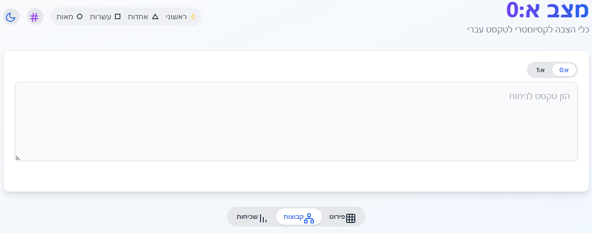

# AlephEfes - reproducible code and data for numeric–semantic analysis of the Hebrew Language

This repository contains a React-based calculator and research notes around the **א=0**  hypothesis.
The project treats the biblical consonantal text as a deliberately engineered system where Hebrew letters are mapped to values **0–21** and processed through a **three-layer valuation** (Units, Tens with Δ9 adjustment, Hundreds).
The aim is to provide an **open playground** for testing the model, exploring its linguistic consequences, and reproducing all calculations.
> **Note**: The calculator interface is in **Hebrew**. Enter Hebrew consonantal text directly into the input field.
> 
> Each word is analysed separately, and line totals are also reported separately.
> 
---



---

## Running the calculator
Requires Node.js 18+ and npm.

```bash

git clone https://github.com/EdanDa/AlephEfes.git
cd AlephEfes
npm install
npm run dev -- --host

```

The app runs on [http://localhost:5173](http://localhost:5173), styled with TailwindCSS (loaded via CDN).
It stores the last analysed text in `localStorage` for convenience.

After you git clone once, you keep that same folder and just pull updates into it:

```bash

cd AlephEfes
git pull
npm install
npm run dev -- --host

```
---

## Structure

```
├── index.html
├── src/
│   ├── App.jsx
│   ├── main.jsx
│   ├── components/
│   │   └── VirtualizedList.jsx
│   ├── core/
│   │   └── analysisCore.js
│   ├── state/
│   │   ├── appReducer.js
│   │   └── appStore.jsx
│   └── workers/
│       └── coreResults.worker.js
├── tests/
│   ├── analysisCore.test.js
│   └── appReducer.test.js
├── docs/
│   └── demo.png
├── package.json
└── vite.config.js

```

---

## Features
The calculator includes the following capabilities:
- **Dual Calculation Modes**
  Switch between Aleph-Zero (א:0) and Aleph-One (א:1) mappings. Both modes apply the same 3-layer valuation but with different base indexing.

- **Digital Root Clusters (ש״ד)**
  Words are grouped by digital root (1–9), with interactive drill-down, search, and re-ordering of clusters.

- **Prime Highlights**
  Prime totals are detected per word and per line. You can customize the highlight color in the legend.

- **Multiple Views**
  - *Lines*: see full breakdown with per-letter calculations, line totals, and prime markers.
  - *Clusters*: explore semantic networks grouped by digital root.
  - *Hot Words*: analyze frequency of values or words, with drill-down into specific value clusters.

- **Data Export**
  One-click copy for:
  - Full analysis (line by line)
  - Summary of clusters or pinned words
  - Unique word calculations
  - Frequency tables

- **Dark Mode**  
  Auto-detects system preference, toggleable at runtime.

- **Performance**
  Uses memoization and a virtualized list for handling large texts efficiently.

---

## Research backdrop

The current working model treats the Hebrew Bible (and its broader West-Semitic onomastic environment) as a **numerically structured lexicon**: not “mysticism,” but the fossil of historically rooted scribal choices. The framework rests on three intertwined pillars (with two key extensions).

### 1) Zero-Indexed Valuation as a minimal, forced coordinate system

Hebrew letters are assigned values from **א=0** through **ת=21** (final forms collapse to their base letter). From this index arise three additive homomorphisms over words:

* **U** (Units): the raw index sum.
* **T** (Tens): **U plus a Δ9 shift** applied from כ onward (the “tens band” mechanism).
* **H** (Hundreds): **T plus fixed hundred-snaps** for ש and ת (the “hundreds band” mechanism).

Crucially, **U, T, and H are congruent mod-9** by construction, so digital-root class is a stable invariant across layers. Under the project’s axioms (linearity, threshold behavior, mod-9 invariance, minimality, and round-hundreds snapping), **T and H are not arbitrary choices**: they are effectively *forced* once the alphabet order and thresholds are fixed.

**Interpretive upgrade (session finding):** under **א=0**, Aleph behaves like a **silent operator**: inserting/removing א leaves values unchanged. Functionally, this resembles a *determinative* in scribal systems (a glyph that changes category/reading without being pronounced). This makes “א as editorial handle” a first-class hypothesis rather than a metaphor.

### 2) Semantic alignment with calendrical and astral constants

Certain values recur as **cultural attractors**—numbers that mattered across Late Bronze / Iron Age scribal worlds (solar/lunar cycles, ritual calendars, ranked divine arithmetic, base-60 legacies). In the Hebrew corpus and adjacent name-imports, key terms repeatedly land on these anchors:

* **יהוה → 22**
* **לבנה → 29**
* **חדש → 30**
* **שמש → 52**
* **ישראל → 59**
* **ישרון → 354 (in H)**
* **עת → 360 (in H)** 
* **ירושלם → 364 (in H)**
* **מלכות / סכות / שבתותי → 365 (in H)**

These are not isolated hits: they form **clusters** that map cleanly onto the calendar seam:

* **52** ↔ weeks in a solar year (365 ≈ 52×7 + 1).
* **354** ↔ lunar year (12 lunar months).
* **364** ↔ schematic/Enochic solar calendar (52×7).
* **360/365** ↔ the base-60 circle-year vs. the 12×30+5 civil year structure (360 + 5 epagomenal days).

**Solar deities:** the “52 bucket” is not just “שמש.” When we transliterate a set of **solar deities across cultures**, many of them converge on **U=52** in א=0 (e.g., Šimegi → שימגי, Vishnu → וישנו, Sekhmet → סקמט, Mithra → מיטרה, Helios → היליוס, Tabiti → תבתי). This looks less like a coincidence and more like a **deliberately loaded residue class**.

A second striking seam is the **59↔354 bridge**:
**ישראל = 59** (U), while **ישרון = 354** (H), and **354 = 59×6**.
That is exactly the kind of “calendar-scale lift” you’d expect if scribal practice treated a base value as a **generator** and higher layers as **structured expansions** rather than unrelated numerology.

### 3) Cross-layer coherence and “semantic nodes”

Because U/T/H are locked together, alignments are not one-off: they **repeat across layers** and produce stable semantic nodes—dense neighborhoods where related words converge.

Example: the **“59-cluster”** (including **ישראל**, **מלכות**, **קשת**, **בתולת**) is not just a list; it behaves like a **network hub** where identity-terms, sovereignty-terms, and calendrical-scale terms interlock across U→T→H. 

This is the central diagnostic: the system behaves less like “pick a gematria and hunt for matches” and more like an **engineered codebook**, where:

* certain congruence classes are privileged,
* certain expansions are predictable (U→T→H),
* and the text repeatedly routes high-salience concepts through the same numeric neighborhoods.

---

## Two extensions that became unavoidable

### A) Orthography as an editorial operator (Aleph-pairs and name-morphisms)

Under א=0, Aleph-insertion creates **meaningful pairings** that read like categorical shifts rather than spelling noise:

* **מלך / מלאך**
* **שרה / אשרה** 
* **אדם / דם**
* **אמת / מת**
* **בריה / בריאה**

This supports a working view that the consonantal layer preserves not only “words” but also **scribal moves**—small orthographic edits that toggle category/status while leaving the numeric signature invariant.

This also resonates with the biblical pattern of **name expansions involving ה/י/ו** (the YHWH letters, present in אברם → אברהם, שרי  → שרה, הושע → יהושע) in key identity moments—suggesting a second family of scribal operations: not only Aleph-silencing, but **YHWH-letter infusion** as a narrative/identity marker. 

### B) The inherited “alphabetic API” hypothesis (human design → later unconscious inheritance)

A coherent, non-mystical explanation emerges: 

> The patterns are shaped by historically rooted choices. Human design is likely a significant factor, as scribal cultures intentionally embedded numerology into their lexicon with modular classes. Later generations inherited these choices unconsciously.

On this view, the “API” is not supernatural—it is a **historical interface**: once the alphabet order, scribal numeracy (calendar + base-60 residues), and orthographic flexibility were in place, editors could **calibrate key names and lexemes** into privileged classes (like the solar 52 bucket), then canonization froze the results.

The repository’s stance is therefore *operational*: treat א=0 as a minimal coordinate system that makes these inherited design pressures **measurable**.

---

## On א=0

An example of the editorial claim:

When inserting the full chapter (23) where Sarah dies, one gets the value 127 for the name of Biblical Hittites, "חת", in the tens layer. This matches precisely the age at which Sarah dies. The digital root of the full chapter is 7, and under א=0, one gets ח=7, so the people' the letter's name and the age of death all align interestingly.

"ויהיו חיי שרה, מאה שנה ועשרים שנה ושבע שנים שני, חיי שרה. ותמת שרה, בקרית ארבע הוא חברון בארץ כנען; ויבא, אברהם, לספד לשרה, ולבכתה. ויקם, אברהם, מעל, פני מתו; וידבר אל בני חת, לאמר. גר ותושב אנכי, עמכם; תנו לי אחזת קבר עמכם, ואקברה מתי מלפני. ויענו בני חת את אברהם, לאמר לו. שמענו אדני, נשיא אלהים אתה בתוכנו  במבחר קברינו, קבר את מתך; איש ממנו, את קברו לא יכלה ממך מקבר מתך. ויקם אברהם וישתחו לעם הארץ, לבני חת. וידבר אתם, לאמר:  אם יש את נפשכם, לקבר את מתי מלפני שמעוני, ופגעו לי בעפרון בן צחר. ויתן לי, את מערת המכפלה אשר לו, אשר, בקצה שדהו:  בכסף מלא יתננה לי, בתוככם לאחזת קבר. ועפרון ישב, בתוך בני חת; ויען עפרון החתי את אברהם באזני בני חת, לכל באי שער עירו לאמר. לא אדני שמעני  השדה נתתי לך, והמערה אשר בו לך נתתיה; לעיני בני עמי נתתיה לך, קבר מתך. וישתחו, אברהם, לפני, עם הארץ. וידבר אל עפרון באזני עם הארץ, לאמר, אך אם אתה לו, שמעני: נתתי כסף השדה, קח ממני, ואקברה את מתי, שמה. ויען עפרון את אברהם, לאמר לו. אדני שמעני, ארץ ארבע מאת שקל כסף ביני ובינך מה הוא; ואת מתך, קבר. וישמע אברהם, אל עפרון, וישקל אברהם לעפרן, את הכסף אשר דבר באזני בני חת  ארבע מאות שקל כסף, עבר לסחר. ויקם שדה עפרון, אשר במכפלה, אשר, לפני ממרא:  השדה, והמערה אשר בו, וכל העץ אשר בשדה, אשר בכל גבלו סביב. לאברהם למקנה, לעיני בני חת, בכל, באי שער עירו.  ואחרי כן קבר אברהם את שרה אשתו, אל מערת שדה המכפלה על פני ממרא  הוא חברון:  בארץ, כנען. ויקם השדה והמערה אשר בו, לאברהם לאחזת קבר: מאת, בני חת."

Another interesting case is the week of creation, where each day receives a unique digital root, resulting in a sequence of 7-1-2-3-5-4-8. The first word has a digital root of 7 (70), the first day has a digital root of 7, and of course this is the story which created in modern society the seven day week as a standard. The first day has 52 words, the number of weeks in a solar year under this cycle. The digital root of the full week is 3, which aligns with the 3 in the middle (the fourth day), the day on which the sun and moon are set in place in the narrative. As well, 3 is the only prime number in the digital roots (or mod groups) of 3,6,9.

---

## On א=1

The same structure is applied to א=1, resulting in a new mapping with similar properties for what has traditionally been several different gematria systems, with the **T** (Tens) layer being a new, unknown mapping until now, resulting in: ר=110, ש=120, ת=130 at the end of that layer. These number align with the ages of death of Joseph and Joshua (At the end of Genesis for Joseph, and with the burial of Joseph's bones when Joshua dies) at 110. With the limitation on human life span in Genesis, and Moses's age of death (Beginning of Genesis, and at the end of Deuteronomy) at 120. And The age at which Adam begat Seth at 130 in the beginning of Genesis.

---

## Repository goal

The goal of this project is not dogma but documentation:

* transparent tools,
* reproducible datasets,
* clear hypotheses (including null models and failure cases),
* and a framework that allows scholarly replication or refutation.

Taken together, the evidence increasingly supports the view that the **alphabet itself—via order, orthography, and modular arithmetic—was used as a carrier of theological and cosmological design**, in a way consistent with ancient scribal culture and its calendar-numeric obsessions.

---

## License

MIT

## Author

Developed by **Edan-David Eyon**  
Independent researcher (Israel)  

I have been pursuing independent study across philosophy, linguistics, history, and mathematics and more since 2011.  
The AlephEfes repository documents and shares a reproducible numeric–semantic framework for the Hebrew Bible and language, which might have been inherited/transported from Mesopotamian/Phoenician/Akkadian traditions.
This repository is intended as an open, transparent resource for testing, replication, and dialogue.

